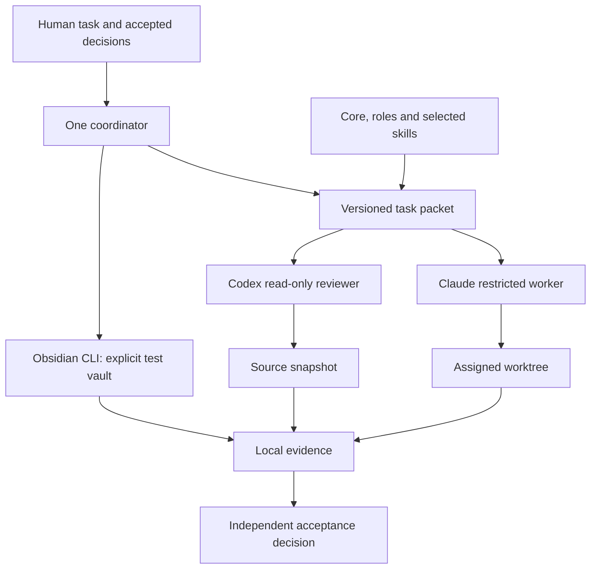
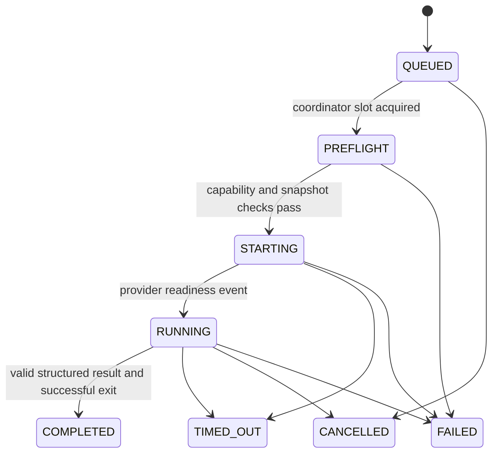

# Architecture and responsibility

## Decision

Claudex owns task contracts and evidence bookkeeping. Native providers execute bounded
jobs. The managed project owns its code and product constraints. The local workspace owns
machine paths, authentication references, private evidence and worktrees.

This split prevents an orchestration migration from turning a product repository into a
copy of one developer's machine. It also makes the public harness independently testable.

## Responsibilities

| Layer | Owns | Does not own |
|---|---|---|
| `config/` | Shared contract, role defaults, result schema | Credentials or private project history |
| `skills/` | Focused procedures and activation descriptions | Another scheduler |
| `profiles/` | Portable project-type requirements | A particular person's vault |
| Native entrypoints | Discovery and references to maintained instructions | Independent copies of the full policy |
| `src/jobs.mjs` | Queue slots, job identity, process state, artifact capture | Semantic truth of a model's claim |
| `src/config.mjs` | The shape of a local configuration, its migration and who answers for a role | Any I/O, or the state it describes |
| `src/setup.mjs` | The installation window: the decisions an installation cannot make for someone else | Writing anything itself |
| `src/approvals.mjs` | One-shot permission for one writing task | Judging whether the work is a good idea |
| `src/claims.mjs` | Which task is working on which files | Preventing a person from overlapping deliberately |
| `src/worktrees.mjs` | What is happening inside each checkout, and how to retire one safely | Deciding when work is finished |
| `src/modes.mjs` | Recorded handover of a provider's roles, and the re-check it owes | Opening a handover on a model's initiative |
| Local project profile | Product constraints and canonical document references | Global model policy |
| Git and GitHub | Version history and publication enforcement | Agent reasoning |

## Authority

Managed Codex roles are read-only and explicitly ignore user configuration. On Windows the
adapter explicitly selects the elevated sandbox implementation, whose setup must already
be available; it never falls back to unrestricted execution. Their nested agent features
are disabled. Managed Claude calls use safe mode, restricted mode, an explicit built-in
tool set and no MCP tools. Only `implementer` may request writing, using file tools in an
assigned worktree. Test/build commands belong to the coordinator.

Native interactive sessions remain native sessions. Their small generated deny rules are
additional guidance, not an operating-system security boundary. If an organization supplies
managed settings, those settings may remain authoritative. Run capability checks for the
actual installed versions and apply organizational isolation where necessary.

## Access, scope and visibility

Three decisions belong to the installation rather than to this repository, and each is a
setting with teeth rather than a note in a document.

**How far a writer may go without asking.** `full`, `scoped` and `approval` differ in what may
be changed, never in what may be read. A fresh installation is `approval`: reasoning and
review run freely, and a person says yes before a file changes. A configuration written by the
previous version is read as `scoped`, because that is what it enforced; an upgrade neither
invents a protection nor drops one.

**Who answers for a role.** The role table carries defaults; an installation may move a role to
the other provider or pin a model and an effort. Only differences are stored, so a change to
the shared table still reaches every installation. A writing role cannot be assigned to a
read-only adapter, and the refusal happens where the choice is made.

**What is already being worked on.** A writing task declares its files and claims them; an
overlapping second writer is refused unless someone records why the overlap is intended.
Reading claims nothing. Three parallel rewrites of the same documents, each unaware of the
others, is what this exists to prevent, and a coarse warning before the work beats a merge
conflict after it.

`doctor` is where these become visible: the access mode, the assignments in effect, every
worktree with its uncommitted work, unfinished operations and shared-install links, open
claims whose owner is gone, open delegations with their outstanding re-check, and approvals
that expired unused. Work is lost in the places nobody looks at.

## Job state and evidence

A shared lock serializes queue claims. Each claimed job has one journal writer. Artifacts
are created once; the mutable job record points to them. Readiness is an actual provider
event, not the successful return of `spawn`. Cancellation kills the process tree and waits
for process closure before marking the job terminal.

A full HEAD and content digest bind source evidence, including relevant untracked files.
The runtime digest covers core code, roles, skills, profile and local configuration. For
read-only review, a changed source digest marks evidence STALE. Writer results identify the
new snapshot and still require independent final-state review. Ignored build artifacts need
their own digest during live acceptance.

`COMPLETED`, `proposedAcceptance` and acceptance are separate fields. Version 0.1.0 captures
the model proposal but deliberately leaves job acceptance UNKNOWN. The independent final
decision is recorded in the managed project's acceptance/decision document with artifact
references. There is no model-controlled command that turns its own claim into product PASS.

## Recovery boundaries

Jobs never resume by "latest conversation". An unfinished task is inspected by exact ID.
`doctor` identifies apparently orphaned jobs; automatic takeover is not implemented. Do not
delete a lock until its owner and any provider process have been inspected. A failed machine
can leave a job nonterminal; that state blocks unsafe automatic duplication.

## Architectural decisions

| ID | Decision | Reason | Revisit when |
|---|---|---|---|
| ADR-001 | One shared core, native adapters | Avoid conflicting schedulers and duplicated policy | A measured adapter limitation cannot be isolated |
| ADR-002 | No third-party runtime dependencies | Small publication and maintenance surface | A dependency demonstrably reduces complexity |
| ADR-003 | Explicit test vault for mutation | Active-window selection is ambiguous | Obsidian offers a stronger stable vault identity API |
| ADR-004 | Acceptance separate from model completion | Local regressions survived convincing summaries | A independently validated verifier can decide a specific criterion |
| ADR-005 | Selective original skills | Smaller context and inspectable dependencies | Paired local evaluation supports another skill |

Source foundations and the distinction between evidence and inference are maintained in
the online [evidence register](https://github.com/ParkPavel/claudex/blob/main/docs/research/evidence-register.md).
